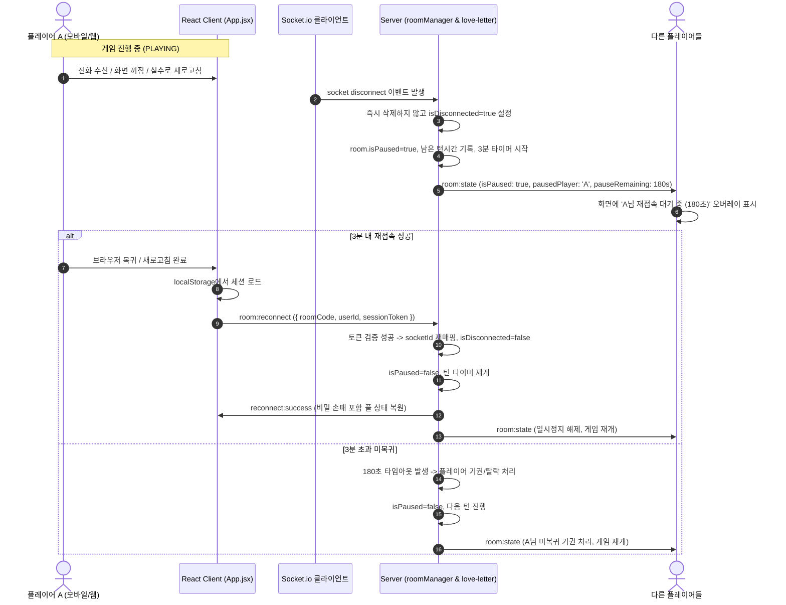

# Wish Boardgame Cafe: 세션 보호 및 재접속/이탈 방지 시스템 설계 문서

> **확정 일자:** 2026-08-30
> **목적:** 웹/모바일 환경에서 새로고침, 네트워크 끊김, 화면 꺼짐, 백그라운드 전환 등으로 인한 비정상 이탈을 완벽 차단하고 3분 내 자동 세션 복구 및 게임 일시정지 시스템 구축

---

## 1. 확정된 요구사항 요약

| 항목 | 결정 사양 |
|:---|:---|
| **비정상 끊김 대응** | 즉시 퇴장 방지. 3분(180초) 유예 시간 + 게임 일시정지(Pause) 오버레이 활성화 |
| **일시정지 중 턴 처리** | 턴 타이머 정지 (남은 시간 보존). 3분 카운트다운 동안 전체 플레이어 대기 |
| **재접속 복귀** | 3분 내 `userId` + `sessionToken`으로 재접속 시 이전 손패/토큰/역할 100% 즉시 복구 및 게임 재개 |
| **3분 초과 미복귀** | 해당 플레이어 기권(탈락) 처리 후 일시정지 해제, 게임 정상 진행 |
| **의도적 나가기(🚪)** | 확인 팝업 표시 → 승인 시 3분 대기 없이 즉시 기권 처리 및 세션 정리 |
| **브라우저 새로고침 방지** | `beforeunload` 이벤트 핸들러 등록 (방/게임 참여 중 이탈 경고) |
| **모바일 화면 꺼짐 방지** | Screen Wake Lock API 연동 (게임 중 자동 절전/화면 꺼짐 방지) |
| **백그라운드 복귀 동기화** | `visibilitychange` & `online` 감지 시 즉시 소켓 핑 및 무중단 재동기화 |
| **로컬 세션 캐싱** | `localStorage`에 `{ userId, sessionToken, nickname, avatarUrl, roomCode }` 저장 |

---

## 2. 시스템 아키텍처 및 상태 흐름도



---

## 3. 상세 컴포넌트별 구현 설계

### 3.1 서버 세션 & 재접속 관리 (`server/shared/roomManager.js`)

- **Player 객체 스키마 확장**:
  ```js
  {
    id: userId,
    sessionToken: `token_${Math.random().toString(36).substr(2, 9)}`,
    socketId: socket.id,
    nickname,
    avatarUrl,
    isReady: false,
    tokens: 0,
    isEliminated: false,
    isProtected: false,
    hand: [],
    discardPile: [],
    isDisconnected: false,
    disconnectedAt: null,
  }
  ```
- **Room 객체 스키마 확장**:
  ```js
  {
    code: roomCode,
    isPaused: false,
    pausedPlayerId: null,
    pauseTimeout: null,
    pauseExpiresAt: null,
    savedTurnRemainingMs: null,
    // ... 기존 상태 유지
  }
  ```
- **소켓 이벤트**:
  - `room:reconnect` (`{ roomCode, userId, sessionToken }`, callback)
    - `sessionToken` 일치 검증
    - 새 `socket.id`로 소켓 매핑 갱신
    - `isDisconnected = false`
    - 만약 해당 룸이 이 플레이어로 인해 `isPaused` 상태였다면 `clearTimeout(room.pauseTimeout)`, `isPaused = false`, 턴 타이머 재개
    - `broadcastRoomState` 호출
  - `disconnect` 핸들러 개선:
    - 대기실(`LOBBY`) 상태:
      - 30초 유예 후 퇴장 처리
    - 게임 진행 중(`PLAYING`, `ROUND_END`) 상태:
      - 플레이어 즉시 삭제 금지!
      - `isDisconnected = true`, `disconnectedAt = Date.now()`
      - `isPaused = true`, `pausedPlayerId = userId`, `pauseExpiresAt = Date.now() + 180000` (3분)
      - 러브레터 턴 타이머 일시정지 (남은 시간 보존)
      - `room.pauseTimeout = setTimeout(() => { handlePauseExpired(roomCode, userId) }, 180000)`
      - `broadcastRoomState` 발행
  - `room:forfeit` / `room:leave` (명시적 나가기):
    - 즉시 기권 탈락 처리 + 룸 정리 (3분 대기 없음)

### 3.2 러브레터 룰 엔진 일시정지 연동 (`server/games/love-letter.js`)

- `pauseGame(room, disconnectedUserId)`:
  - 턴 타이머(`room.turnTimer`) 클리어
  - 현재 시각과 `turnStartTime`을 비교하여 남은 턴 시간(`savedTurnRemainingMs`) 계산 저장
- `resumeGame(io, room)`:
  - `room.isPaused = false`
  - `savedTurnRemainingMs`가 있다면 해당 남은 시간으로 `room.turnTimer` 재개
  - 브로드캐스트

### 3.3 클라이언트 브라우저 이탈 방지 훅 (`src/shared/useSessionGuard.js`)

- **Screen Wake Lock API**:
  - `screen === 'waitingRoom' || screen === 'game'` 진입 시 `navigator.wakeLock.request('screen')` 호출
  - 화면 꺼짐 및 슬립 모드 진입 방지
- **`beforeunload` 이벤트 리스너**:
  - 방 입장 상태 시 `e.preventDefault()`, `e.returnValue = ''`로 브라우저 경고창 팝업
- **`visibilitychange` & `online` 이벤트 리스너**:
  - 탭 복귀 시 소켓 연결 상태 확인 → 끊겨있으면 소켓 재연결 및 `room:reconnect` 즉시 전송
- **로컬 스토리지 세션 저장/복구 유틸**:
  - `saveSession(sessionData)`: `localStorage.setItem('wish_boardgame_session', JSON.stringify(...))`
  - `loadSession()`: 저장된 세션 반환
  - `clearSession()`: 세션 삭제

### 3.4 UI 일시정지 오버레이 (`src/shared/components.jsx` & `LoveLetterBoard.jsx`)

- **PauseOverlay (글래스모피즘 일시정지 화면)**:
  - `roomState.isPaused === true` 시 게임 화면 전체에 블러 오버레이 렌더링
  - 내용:
    - ⏳ 일시정지 아이콘 + `[끊긴 플레이어 닉네임] 님의 연결이 끊겼습니다.`
    - 실시간 3분 카운트다운 타이머: `재접속 대기 시간: 02:45`
    - "해당 플레이어가 다시 접속하면 게임이 자동으로 이어집니다."
- **나가기 확인 다이얼로그**:
  - 🚪 버튼 클릭 시 "정말 게임을 포기하고 퇴장하시겠습니까? (즉시 패배 처리됩니다)" 모달 팝업

---

## 4. 검증 계획

1. **새로고침 복구 테스트**: 게임 도중 F5 새로고침 → 3초 내 이전 방/손패로 무중단 복귀 확인
2. **소켓 강제 차단 테스트**: Wi-Fi 끄기 또는 개발자 도구 Offline 모드 → 3분 일시정지 카운트다운 표시 확인 → Online 복귀 시 자동 재개 확인
3. **3분 타임아웃 테스트**: 미복귀 시 180초 후 자동 기권 및 게임 재개 확인
4. **나가기 버튼 확인 테스트**: 나가기 모달 승인 시 즉시 패배 처리 및 대기 없이 방 정리 확인
5. **Vite 빌드 & 룰 엔진 테스트**: `npm test` 및 `npm run build` 100% Pass
