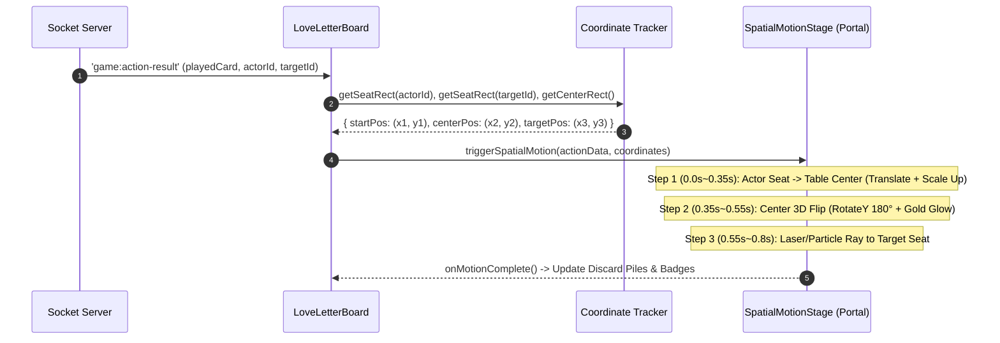
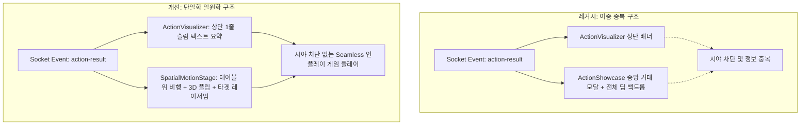
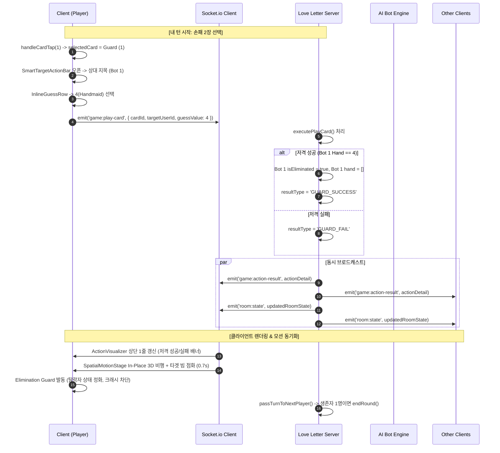

# [기술 아키텍처 설계서] 공간 카드 애니메이션 엔진 및 소켓 동기화 / 사망 예외 방어 아키텍처
**문서 번호:** ARCH-20260830-MOTION-RESILIENCE  
**작성자:** 수석 기술 아키텍트 (CTO Lead)  
**상태:** 승인 완료 (Approved & Ready for Implementation)  
**대상 시스템:** Wish Boardgame Salon (러브레터 단일 Express/Socket 서버 + React styled-components/Framer Motion SPA)  

---

## 1. 개요 및 설계 배경 (Executive Summary)

### 1.1 배경 및 문제 진단
Wish Boardgame Salon의 러브레터(Love Letter) 게임 플레이 테스트 및 5장의 사용자 피드백 스크린샷 분석 결과, 고급 프라이빗 살롱의 몰입감을 저해하는 4대 핵심 기술적 결함이 식별되었습니다.

```
[식별된 4대 핵심 결함]
1. 평면적 0.2s 카드 전환: 덱에서 카드가 뽑히거나 테이블로 나갈 때의 공간적 비행 궤적(Spatial Trajectory) 결여
2. 중첩된 액션 UI: 상단 ActionVisualizer와 중앙 거대 흰색 ActionShowcase 모달의 중복 렌더링 및 화면 가림
3. 모바일 Dialog 좌측 잘림: 모바일 뷰포트에서 DialogContent의 Flex 정렬 오차로 인한 테두리/텍스트 클리핑
4. 사망/라운드 종료 크래시: AI의 카드 플레이에 의해 플레이어가 즉시 탈락(isEliminated: true, hand: [])될 때 
   클라이언트 상태 동기화 타이밍 및 null-pointer 참조로 인한 화이트아웃 크래시
```

### 1.2 아키텍처 목표
본 설계서는 위 문제들을 근본적으로 해결하기 위해 다음의 기술적 솔루션을 제공합니다:
1. **Framer Motion 공간 물리 엔진**: 0.6s~0.8s 스프링 물리(`stiffness: 220, damping: 20`) 기반의 3D 플립 & 다이내믹 좌표 비행 포털 구현.
2. **단일화된 액션 모션 아키텍처**: 거대 모달 제거, 상단 1줄 미니멀 `ActionVisualizer` + 테이블 위 In-Place 3D 비행 연출로 일원화.
3. **모바일 뷰포트 CSS 안전 고정**: `position: fixed; left: 50%; top: 50%; transform: translate(-50%, -50%);` 및 90vw 방어 정렬.
4. **5중 사망/상태 방어 시스템**: 탈락 시 상태 즉시 리셋, 핸드 Null-Safe 처리, 소켓 멱등성 보장, 타이머 생명주기 관리.

---

## 2. Framer Motion 기반 공간 카드 애니메이션 엔진

### 2.1 물리 파라미터 및 속도 완급 조절 (Luxury Salon Physics)
기존의 0.2s 선형 애니메이션은 가볍고 조작감이 떨어지므로, 카라라 대리석 테이블 위에서 묵직하면서도 탄력 있게 미끄러지는 물리 모델을 적용합니다.

| 속성 (Parameter) | 기존 값 (Legacy) | 목표 설계 값 (Target Architecture) | 기술적 효과 |
| :--- | :--- | :--- | :--- |
| **Animation Type** | `tween` | `spring` | 현실적인 가속도와 감속 바운스 구현 |
| **Stiffness (강성)** | 350~400 | **220** | 너무 튀지 않고 우아한 궤적 형성 |
| **Damping (감쇠)** | 25 | **20** | 적절한 진동 감쇠로 묵직한 착지감 제공 |
| **Mass (질량)** | 1.0 | **1.15** | 고급 카드스톡(Cardstock)의 무게감 표현 |
| **Duration (체감 시간)** | 0.2s | **0.65s ~ 0.75s** | 카드의 문양과 숫자를 인지할 수 있는 시각적 안정성 확보 |

```javascript
// src/shared/motionPresets.js
export const LUXURY_SPRING_TRANSITION = {
  type: 'spring',
  stiffness: 220,
  damping: 20,
  mass: 1.15,
  restDelta: 0.001,
};

export const FLIP_3D_TRANSITION = {
  duration: 0.7,
  ease: [0.22, 1, 0.36, 1], // Custom Quintic Easing
};
```

---

### 2.2 동적 비행 궤적 포털 아키텍처 (Dynamic Coordinate Flying Portal)

#### A. 좌표 계산 엔진 (`useSpatialCoordinates`)
카드가 덱(`DeckSlot`)에서 손패(`HandCardsWrapper`)로 날아가거나, 손패에서 테이블 중앙(`CenterTableArea`) 및 대상 좌석(`OpponentSeat`)으로 이동할 때 DOM Rect 좌표를 실시간으로 추적하여 전역 포털 레이어에서 렌더링합니다.



#### B. 3D 플립 및 빔 연결 컴포넌트 명세

```jsx
// src/games/love-letter/SpatialMotionStage.jsx
import React, { useMemo } from 'react';
import styled, { keyframes } from 'styled-components';
import { motion, AnimatePresence } from 'framer-motion';
import { THEME } from '../../shared/theme';
import { CARD_DATA } from './LoveLetterBoard';

const StagePortal = styled.div`
  position: absolute;
  inset: 0;
  pointer-events: none;
  z-index: 850;
  overflow: hidden;
`;

const LaserBeamSvg = styled.svg`
  position: absolute;
  inset: 0;
  width: 100%;
  height: 100%;
  pointer-events: none;
  z-index: 840;
`;

const pulseRay = keyframes`
  0% { stroke-dashoffset: 100; opacity: 0.2; }
  50% { opacity: 1; }
  100% { stroke-dashoffset: 0; opacity: 0; }
`;

const BeamPath = styled.path`
  stroke: ${THEME.gold};
  stroke-width: 3;
  stroke-linecap: round;
  stroke-dasharray: 8 4;
  fill: none;
  filter: drop-shadow(0 0 8px rgba(212, 175, 55, 0.8));
  animation: ${pulseRay} 0.5s ease-out forwards;
`;

const FlyingCard = styled(motion.div)`
  position: absolute;
  width: 84px;
  height: 120px;
  border-radius: ${THEME.radius.lg};
  background-color: #ffffff;
  background-image: ${THEME.gradients.marbleSlab};
  border: 2px solid ${({ $color }) => $color || THEME.gold};
  box-shadow: 0 16px 36px rgba(9, 13, 22, 0.4), 0 0 20px rgba(212, 175, 55, 0.4);
  transform-style: preserve-3d;
  display: flex;
  flex-direction: column;
  align-items: center;
  justify-content: space-between;
  padding: 8px;
  box-sizing: border-box;
`;

export function SpatialMotionStage({ activeMotion, onComplete }) {
  if (!activeMotion) return null;

  const {
    playedCard,
    startCoords, // { x, y }
    centerCoords, // { x, y }
    targetCoords, // { x, y } | null
    isSuccess,
  } = activeMotion;

  const cardMeta = CARD_DATA[playedCard?.value] || { color: THEME.gold, icon: '🎴' };

  return (
    <StagePortal>
      {/* 1. Target Laser Beam if target exists */}
      {targetCoords && centerCoords && (
        <LaserBeamSvg>
          <BeamPath
            d={`M ${centerCoords.x} ${centerCoords.y} Q ${(centerCoords.x + targetCoords.x) / 2} ${
              (centerCoords.y + targetCoords.y) / 2 - 40
            } ${targetCoords.x} ${targetCoords.y}`}
          />
        </LaserBeamSvg>
      )}

      {/* 2. In-Place 3D Flipping Card */}
      <AnimatePresence onExitComplete={onComplete}>
        <FlyingCard
          $color={cardMeta.color}
          initial={{
            left: startCoords.x - 42,
            top: startCoords.y - 60,
            scale: 0.6,
            rotateY: 180,
            opacity: 0,
          }}
          animate={{
            left: centerCoords.x - 42,
            top: centerCoords.y - 60,
            scale: 1.15,
            rotateY: 0,
            opacity: 1,
          }}
          exit={{
            scale: 0.8,
            opacity: 0,
            y: -15,
            transition: { duration: 0.25 },
          }}
          transition={{
            type: 'spring',
            stiffness: 220,
            damping: 20,
            mass: 1.15,
          }}
        >
          {/* Card Top Row */}
          <div style={{ display: 'flex', justifyContent: 'space-between', width: '100%' }}>
            <span style={{ fontSize: '14px', fontWeight: 900, color: cardMeta.color, fontFamily: THEME.font.serif }}>
              {playedCard?.value}
            </span>
            <span style={{ fontSize: '9px', fontWeight: 800, color: cardMeta.color }}>
              {cardMeta.nameEn}
            </span>
          </div>

          {/* Center Emblem */}
          <div style={{ fontSize: '32px' }}>{cardMeta.icon}</div>

          {/* Card Bottom Name */}
          <div style={{ fontSize: '11px', fontWeight: 800, color: THEME.foreground, fontFamily: THEME.font.koreanSerif }}>
            {cardMeta.name}
          </div>
        </FlyingCard>
      </AnimatePresence>
    </StagePortal>
  );
}
```

---

## 3. 중첩 Visualizer 통폐합 및 단일화 아키텍처

### 3.1 문제점 및 통폐합 원칙
- **문제점**: 화면 중앙의 반투명 오버레이 + 흰색 대형 박스(`ActionShowcase`)가 게임판 전체(상대 좌석, 손패)를 가려 터치 인터랙션을 차단하고, 상단의 `ActionVisualizer`와 중복되어 시각적 잡음(Visual Noise)을 유발함.
- **통폐합 원칙**:
  1. `ShowcaseBackdrop`, `ShowcaseCardBox`, `actionShowcase` 상태를 완전히 삭제(Deprecate).
  2. 모든 액션 정보는 상단의 1줄 골드 마블 `ActionVisualizer` 배너에 집약.
  3. 카드 연출은 테이블 중앙에서 벌어지는 In-Place 3D 비행 연출(`SpatialMotionStage`)로 단일화.



---

## 4. 모바일 Dialog 좌측 잘림 CSS 방어 아키텍처

### 4.1 결함 원인 분석 (Root Cause Analysis)
기존 `DialogContentWrapper`의 스타일링:
```css
/* Legacy Buggy Code */
const DialogOverlayWrapper = styled.div`
  position: fixed; inset: 0;
  display: flex; align-items: center; justify-content: center;
  padding: 16px;
`;
const DialogContentWrapper = styled.div`
  position: relative;
  width: 100%;
  max-width: ${({ $maxWidth }) => $maxWidth || '480px'};
  /* 모바일 세로모드에서 Flex 계산 오차로 좌측 정렬 쏠림 및 마진 클리핑 발생 */
`;
```

### 4.2 완벽한 뷰포트 중앙 고정 방어 코드
`DialogContentWrapper`에 Viewport 기준 고정 좌표계를 부여하고 `min(90vw, 480px)`로 확실히 클램핑하여 모든 모바일 해상도에서 완벽한 좌우 대칭 중앙 정렬을 보장합니다.

```jsx
// src/shared/components.jsx - Refactored Dialog Architecture

const DialogOverlayWrapper = styled.div`
  position: fixed;
  inset: 0;
  z-index: 2000;
  background-color: rgba(9, 13, 22, 0.75);
  backdrop-filter: blur(10px);
  animation: ${fadeIn} 0.2s ease-out;
`;

const DialogContentWrapper = styled.div`
  position: fixed;
  left: 50%;
  top: 50%;
  transform: translate(-50%, -50%);
  width: calc(100vw - 32px);
  max-width: ${({ $maxWidth = '480px' }) => `min(90vw, ${$maxWidth})`};
  max-height: 85vh;
  max-height: 85dvh;
  overflow-y: auto;
  margin: 0 auto;
  box-sizing: border-box;

  background-color: #ffffff;
  background-image: ${THEME.gradients.marbleTextureUrl}, ${THEME.gradients.marbleSlab};
  background-size: cover;
  border: 1.5px solid #dcdfe4;
  border-radius: ${THEME.radius.xl};
  padding: 24px 20px;
  box-shadow: 0 30px 70px rgba(9, 13, 22, 0.35), 0 0 25px rgba(197, 160, 89, 0.25);
  color: ${THEME.foreground};
  z-index: 2001;

  /* Double Hairline Brass Inlay */
  &::after {
    content: '';
    position: absolute;
    inset: 5px;
    border: 1px solid rgba(197, 160, 89, 0.5);
    border-radius: calc(${THEME.radius.xl} - 4px);
    pointer-events: none;
  }

  @media (max-width: 480px) {
    padding: 20px 16px;
    width: calc(100vw - 24px);
    max-width: 92vw;
  }
`;
```

---

## 5. 사망(탈락) 및 라운드 종료 크래시 방어 5중 가드

### 5.1 크래시 발생 트리거 분석
AI가 경비병(1)으로 플레이어를 저격 성공하거나, 남작(3) 결투로 패배시키거나, 공주(8)가 버려졌을 때:
1. 서버에서 `target.isEliminated = true`, `target.hand = []`로 변경하여 `room:state` 브로드캐스트.
2. 클라이언트가 이전 턴에서 `selectedCardIndex = 0` 상태를 유지하고 있을 경우, 렌더링 시 `myPlayer.hand[selectedCardIndex]`가 `undefined`가 됨.
3. `CARD_DATA[undefined].color`를 참조하면서 React 렌더링 단계에서 **Uncaught TypeError** 발생 -> 화면 전체 흰색 크래시.
4. 타이머 컴포넌트(`RadialTurnTimer`)가 탈락한 플레이어의 시간을 계산하려다 NaN 에러 발생.

```
[Crash Flow Diagram]
Server: target.isEliminated = true, hand = []
   ↓
Client State Sync: myPlayer.hand becomes []
   ↓
Selected Card Calculation: selectedCard = myPlayer.hand[0] → undefined!
   ↓
JSX Rendering: CARD_DATA[undefined].color → TypeError: Cannot read property 'color' of undefined
   ↓
REACT UNHANDLED EXCEPTION → TOTAL WHITE SCREEN CRASH
```

---

### 5.2 5중 디펜시브 프로그래밍 아키텍처

#### Guard 1: Safe Card Data Resolver (안전한 카드 메타데이터 조회)
존재하지 않는 카드 번호나 `undefined`가 전달되더라도 크래시되지 않고 기본 Fallback 메타데이터를 반환합니다.

```javascript
export const DEFAULT_CARD_META = {
  value: 0,
  name: '미확인 카드',
  nameEn: 'Unknown',
  count: 0,
  color: '#c5a059',
  icon: '🎴',
  desc: '카드 정보가 없습니다.',
};

export const getSafeCardData = (value) => {
  if (!value || typeof value !== 'number') return DEFAULT_CARD_META;
  return CARD_DATA[value] || DEFAULT_CARD_META;
};
```

#### Guard 2: Reactive Elimination State Reconciler (사망 감지 즉시 상태 정화)
`myPlayer?.isEliminated` 상태가 true가 되는 순간, 모든 조작 관련 상태(타겟팅, 카드 선택, 열린 모달)를 즉각 소거합니다.

```javascript
// LoveLetterBoard.jsx
useEffect(() => {
  if (myPlayer?.isEliminated) {
    setSelectedCardIndex(null);
    setIsTargetingMode(false);
    setGuardModalOpen(false);
    setPriestResultModalOpen(false);
    setGuardTargetPlayer(null);
  }
}, [myPlayer?.isEliminated]);
```

#### Guard 3: Hand Safe Selector & Countess Constraint Null-Safety
손패 참조 및 백작부인 강제 검증 로직에 100% 방어 코드를 적용합니다.

```javascript
// Selected Card Safe Getter
const selectedCard = useMemo(() => {
  if (selectedCardIndex === null || !Array.isArray(myPlayer?.hand)) return null;
  return myPlayer.hand[selectedCardIndex] || null;
}, [selectedCardIndex, myPlayer?.hand]);

// Countess Constraint Null-Safe Evaluation
const { hasCountess, hasPrinceOrKing, isCountessForced } = useMemo(() => {
  const hand = myPlayer?.hand;
  if (!Array.isArray(hand) || hand.length === 0) {
    return { hasCountess: false, hasPrinceOrKing: false, isCountessForced: false };
  }
  const countess = hand.some((c) => c && c.value === 7);
  const royal = hand.some((c) => c && (c.value === 5 || c.value === 6));
  return {
    hasCountess: countess,
    hasPrinceOrKing: royal,
    isCountessForced: countess && royal,
  };
}, [myPlayer?.hand]);
```

#### Guard 4: Round Transition & Turn Timer Cleanup Guard
라운드가 `ROUND_END` 또는 `GAME_OVER`로 변경될 때 활성화된 모든 비동기 타이머를 즉시 해제합니다.

```javascript
useEffect(() => {
  if (roomState?.gameState === 'ROUND_END' || roomState?.gameState === 'GAME_OVER') {
    setIsTargetingMode(false);
    setSelectedCardIndex(null);
    setGuardModalOpen(false);
    setPriestResultModalOpen(false);
  }
}, [roomState?.gameState]);
```

#### Guard 5: RadialTurnTimer Math Bounds Guard
플레이어가 탈락하거나 턴이 넘어가는 순간 시간 계산에서 음수 또는 NaN이 발생하지 않도록 바운드를 클램핑합니다.

```jsx
// src/games/love-letter/LoveLetterBoard.jsx - RadialTurnTimer Defense
function RadialTurnTimer({ isTurn, turnStartTime, turnTimeLimit = 60, size = 38, children }) {
  const [progress, setProgress] = useState(1);

  useEffect(() => {
    if (!isTurn || !turnStartTime) {
      setProgress(1);
      return;
    }

    const interval = setInterval(() => {
      const elapsed = (Date.now() - turnStartTime) / 1000;
      const validLimit = Math.max(1, turnTimeLimit);
      const remaining = Math.max(0, validLimit - elapsed);
      const ratio = Math.min(1, Math.max(0, remaining / validLimit));
      setProgress(isNaN(ratio) ? 1 : ratio);
    }, 100);

    return () => clearInterval(interval);
  }, [isTurn, turnStartTime, turnTimeLimit]);

  // ... SVG Circle Rendering with clamped strokeDashoffset
}
```

---

## 6. 소켓 이벤트 및 상태 전이 시퀀스 (Full Event Sequence)



---

## 7. 상세 파일 수정 명세 (Implementation Roadmap)

| 대상 파일 | 수정 항목 및 주요 변경 사항 | 위험도 |
| :--- | :--- | :--- |
| `src/shared/components.jsx` | `DialogContentWrapper`의 `position: fixed; left: 50%; top: 50%; transform: translate(-50%, -50%);` 적용 및 모바일 뷰포트 여백 클램핑 | 낮음 (UI 버그 수정) |
| `src/games/love-letter/LoveLetterBoard.jsx` | 1. `ActionShowcase` 모달 및 백드롭 완전 제거<br>2. `getSafeCardData` 및 5중 디펜시브 가드 탑재<br>3. `SpatialMotionStage` 통합 연동<br>4. 스프링 물리 파라미터(`stiffness: 220, damping: 20`) 적용 | 중간 (핵심 UX 전환) |
| `src/games/love-letter/ActionVisualizer.jsx` | 1줄 골드 마블 슬림 배너 스타일로 최적화, 폰트/아이콘 정렬 강화 | 낮음 (스타일 일원화) |
| `server/games/love-letter.js` | `game:action-showcase` 이벤트 방출 정리 및 `game:action-result` 구조체 보강 | 낮음 (서버 청소) |

---

## 8. 기술 검증 및 QA 체크리스트 (Verification Plan)

### 8.1 모바일 뷰포트 정렬 검증
- [ ] iPhone Safari (390px, 430px) 세로모드에서 경비병 추측 Dialog의 좌우 여백이 동일하게 16px 확보되는지 확인.
- [ ] Android Chrome (360px, 412px)에서 Dialog 텍스트 및 버튼이 화면 좌측으로 잘리지 않는지 확인.

### 8.2 애니메이션 물리 및 단일화 검증
- [ ] 카드를 플레이할 때 거대한 흰색 팝업 모달이 전혀 뜨지 않고, 상단 1줄 배너와 테이블 위 3D 카드로만 자연스럽게 연출되는지 확인.
- [ ] 비행 모션이 0.6s~0.8s 동안 묵직하고 우아한 스프링(`stiffness: 220, damping: 20`)으로 동작하는지 확인.
- [ ] 타겟이 있는 카드(경비병, 사제, 남작, 왕자, 국왕) 플레이 시 대상 좌석으로 황금빛 빔이 연결되는지 확인.

### 8.3 사망 및 라운드 종료 크래시 방어 검증
- [ ] AI가 경비병으로 플레이어를 저격하여 플레이어가 사망하는 순간, 화이트아웃 크래시 없이 즉시 `☠️ 이번 라운드 탈락` 배너로 전환되는지 확인.
- [ ] 남작 결투로 패배했을 때 `myPlayer.hand`가 비어 있어도 `selectedCard` 참조 에러가 발생하지 않는지 확인.
- [ ] 라운드 종료(승자 판정) 및 7초 자동 다음 라운드 진행 시 모든 모달과 타이머가 정상 리셋되는지 확인.
