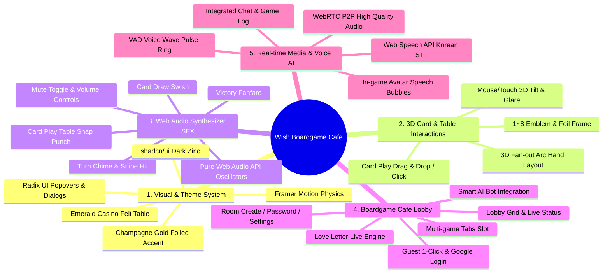
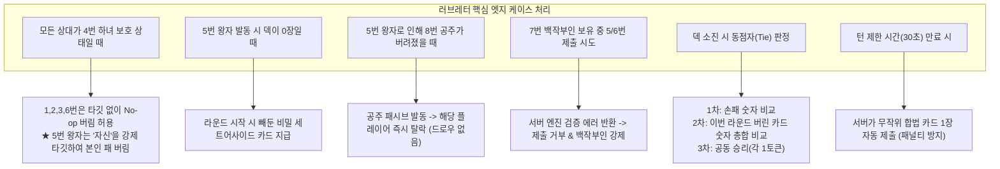
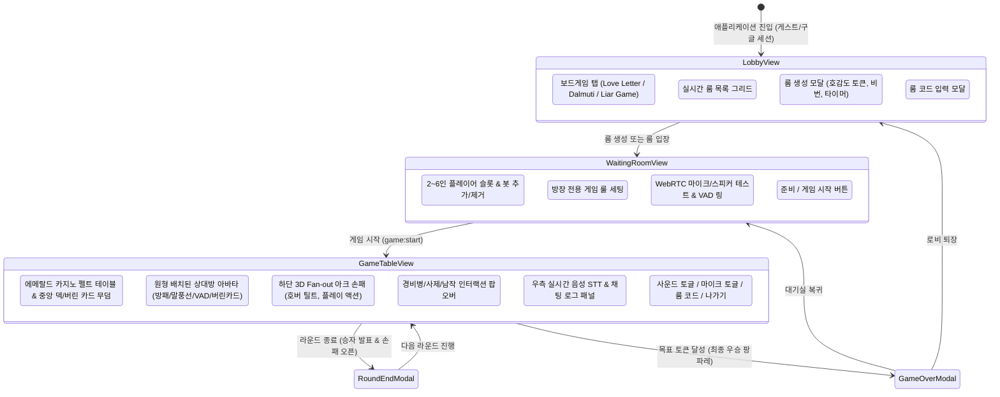

# [PRD] Wish Boardgame Cafe - shadcn/ui 기반 전면 재디자인 & 러브레터 엔진 제품 요구사항 명세서

**문서 버전**: v2.0.0  
**작성자**: bkit-pm-lead (Lead Product Manager)  
**작성일**: 2026-08-30  
**프로젝트 상태**: Approved (마스터 플랜 확정)

---

## 1. 제품 개요 및 전략적 비전 (Product Overview & Strategic Vision)

### 1.1 제품 정의 (Product Definition)
**Wish Boardgame Cafe**는 별도의 설치나 회원가입 장벽 없이 웹 브라우저에서 즉시 접속하여 친구들과 실시간 고음질 음성 통화(WebRTC) 및 한국어 음성 자막(STT)과 함께 즐길 수 있는 **프리미엄 멀티플레이어 보드게임 카페 플랫폼**입니다.

첫 번째 플래그십 라이브 타이틀로 **[러브레터 (Love Letter)]** 클래식 1~8번 카드 풀 룰 엔진을 탑재하며, 향후 **[달무티 (The Great Dalmuti)]**, **[라이어 게임 (Liar Game)]** 등 다양한 파티 보드게임으로 확장 가능한 모듈러 카페 아키텍처를 지향합니다.

### 1.2 핵심 타깃 페르소나 (Target Personas)
1. **캐주얼 파티 게이머 (2030 세대)**: 디스코드나 복잡한 게임 클라이언트 설치 없이 링크/룸 코드 하나로 친구들을 모아 5~15분 동안 가볍게 보드게임을 즐기려는 유저.
2. **보드게임 애호가**: 오프라인 보드게임의 손맛(3D 카드 틸트, 부채꼴 손패, 타격감 있는 효과음, 묵직한 카지노 펠트 테이블)을 온라인에서도 그대로 경험하고 싶은 유저.
3. **음성 대화 선호 유저**: 게임 플레이와 동시에 실시간 음성 통화 및 음성 인식 자막(말풍선)을 통해 생생한 블러핑과 심리전을 즐기려는 유저.

### 1.3 비즈니스 및 기술적 가치 (Value Proposition)
- **Zero Infrastructure Cost (비용 최적화)**: SFU 미디어 서버 없이 WebRTC P2P Mesh를 활용하고, 유료 STT/에셋 라이선스 대신 브라우저 표준 Web Speech API 및 Web Audio API 내장 신시사이저를 채택하여 운영 비용을 0원에 가깝게 유지.
- **Micro-Interaction & Premium Luxury Aesthetic**: 최고급 shadcn/ui Dark Zinc 테마와 에메랄드 카지노 펠트 & 샴페인 골드 포일 디자인을 융합하여 상용 패키지 게임 수준의 심미적 만족감 제공.
- **Extensible Architecture**: 단일 보드게임에 국한되지 않고 다양한 턴제/실시간 보드게임을 탭 형태로 플러그인할 수 있는 모듈러 플랫폼 설계.

---

## 2. 제품 핵심 사양 (Core Feature Specifications)

---

### 2.1 [사양 1] shadcn/ui Dark Zinc 테마 & 럭셔리 보드게임 카페 UI

- **디자인 철학**: 정갈하고 모던한 미니멀리즘(Dark Zinc)과 고풍스러운 유럽 보드게임 살롱의 럭셔리함(에메랄드 펠트 & 샴페인 골드)의 결합.
- **컬러 팔레트 시스템**:
  - **Base Background**: `zinc-950` (`#09090b`), `zinc-900` (`#18181b`), `zinc-800` (`#27272a`)
  - **Borders & Dividers**: `1px border-zinc-800`, `border-zinc-700/60` (Radix 스타일 정밀 보더)
  - **Felt Table Background**: 에메랄드 펠트 그라데이션 (`#064e3b` -> `#022c22` -> `#011f18`) + 미세 노이즈 텍스처
  - **Accents & Highlights**: 샴페인 골드 (`#fbbf24`, `#d97706`, `#fef08a`), 앤틱 골드 엠보싱 글로우
  - **Status Colors**: 하녀 방패 앰버/스카이블루 (`#38bdf8`), VAD 음성 파동 에메랄드 (`#10b981`), 위험/탈락 로즈레드 (`#f43f5e`)
- **컴포넌트 스타일 가이드**:
  - Radix UI 기반 모던 팝오버, 다이얼로그, 툴팁, 드롭다운 메뉴 스타일 적용
  - 글래스모피즘(`backdrop-blur-md`, `bg-zinc-900/80`) 오버레이 및 부드러운 스프링 트랜지션.

---

### 2.2 [사양 2] 3D 부채꼴(Fan-out) 손패 & 틸트(Tilt) 카드 인터랙션

- **3D Fan-out 아크 레이아웃**:
  - 플레이어가 손에 쥔 카드 수(1~2장)에 따라 자연스러운 부채꼴 아크 곡선으로 펼침.
  - 1장 보유 시: 회전 각도 `0deg`, 중심 배치.
  - 2장 보유 시: 좌측 카드 `-7deg` (X: `-24px`, Y: `+6px`), 우측 카드 `+7deg` (X: `+24px`, Y: `+6px`).
  - 호버(Hover) 시: 해당 카드가 z-index 최상단으로 팝업되며 `scale(1.15)`, 회전 각도 `0deg` 리셋, Y축 `-32px` 리프트업.
- **3D 틸트(Tilt) & 글레어(Glare) 광택**:
  - 마우스 커서 위치(`offsetX`, `offsetY`)에 반응하여 `perspective(1000px) rotateX(...) rotateY(...)` 실시간 틸트.
  - 카드 표면에 각도에 따라 이동하는 무지갯빛/샴페인 골드 홀로그램 광택 레이어(Specular Glare Overlay) 합성.
- **1~8번 카드 고유 엠블럼 및 샴페인 골드박 프레임**:
  - 각 카드 등급별 상징 엠블럼 아이콘(Lucide 및 커스텀 SVG):
    - 1번 경비병(Guard): 방패 & 검 엠블럼 (Guard Tower)
    - 2번 사제(Priest): 성서 & 은총 엠블럼 (Holy Cross/Scroll)
    - 3번 남작(Baron): 결투의 레이피어 엠블럼 (Crossed Swords)
    - 4번 하녀(Handmaid): 수호의 결계 엠블럼 (Aegis Shield)
    - 5번 왕자(Prince): 왕가의 인장 깃털 엠블럼 (Feather & Crest)
    - 6번 국왕(King): 황금 왕관 엠블럼 (Golden Crown)
    - 7번 백작부인(Countess): 루비 팬던트 엠블럼 (Noble Jewel)
    - 8번 공주(Princess): 찬란한 티아라 엠블럼 (Diamond Tiara)
  - 카드 외곽: 2중 골드박 1px 포일 라인 + 코너 앤틱 오너먼트 문양.

---

### 2.3 [사양 3] Web Audio API 신시사이저 타격감 사운드 시스템

외부 오디오 파일 의존성(네트워크 딜레이, 404 에러, 저작권 이슈)을 원천 배제하고, 브라우저 `AudioContext`의 `OscillatorNode`, `BiquadFilterNode`, `GainNode`를 실시간 합성하여 묵직하고 선명한 타격감의 사운드 생성.

| 사운드 이벤트 | 합성 파이프라인 및 사운드 특성 | 음향 목적 |
| :--- | :--- | :--- |
| **1. 카드 드로우 (Card Draw)** | 화이트 노이즈 버퍼 + Lowpass Filter Sweep (8000Hz -> 400Hz) + Decay 0.15s | 종이가 덱에서 스르륵 빠져나가는 실감 나는 슬라이드감 |
| **2. 카드 제출/플레이 (Card Play)** | 사인파 120Hz 드롭 펀치(Kick Punch) + 삼각파 800Hz 스냅 탭 + 리버브 테일 (Decay 0.25s) | 테이블 위에 카드를 탁! 하고 내리치는 묵직한 손맛 |
| **3. 내 턴 알림 (Turn Alert)** | 듀얼 사인파 아르페지오 (C6 1046Hz -> E6 1318Hz, Bell Chime Envelope) | 맑고 경쾌한 샴페인 잔 부딪히는 턴 인지 신호 |
| **4. 저격/결투 성공 (Snipe Hit)** | 삼각파 피치 드롭 (440Hz -> 880Hz -> 1760Hz 급상승) + 브라스틱 하모닉 왜곡 | 경비병 저격 성공 / 남작 결투 승리 시 극적 쾌감 |
| **5. 매치 우승 (Victory Fanfare)** | 메이저 코드 트라이어드 아르페지오 (C5-E5-G5-C6) + 팡파레 시퀀스 (0.8s) | 라운드/최종 매치 승리 시 영예로운 세리머니 |

- **사운드 컨트롤 UI**: 상단 바에 사운드 음소거/활성화 토글 버튼(`Volume2` / `VolumeX`) 및 볼륨 슬라이더 제공 (LocalStorage 상태 보존).

---

### 2.4 [사양 4] shadcn/ui 탭 & 카드 그리드 보드게임 카페 로비

- **멀티게임 탭 내비게이션**:
  - `[전체 게임]` / `[러브레터 (Live 🔥)]` / `[달무티 (개발 예정 ⏳)]` / `[라이어 게임 (개발 예정 ⏳)]` / `[내 전적]`
  - 활성화된 탭은 shadcn 스타일의 인디케이터와 함께 부드러운 전환 애니메이션 제공.
- **러브레터 룸 생성 & 설정 모달 (Radix Dialog)**:
  - **룸 공개 범위**: 공개방(Public) / 비공개 비밀번호방(Private)
  - **목표 호감도 토큰 수**: 2인(7개), 3인(5개), 4인(4개), 5~6인(3개) 또는 사용자 지정(2~7개)
  - **턴 제한 시간**: 15초 / 30초 / 45초 / 무제한
  - **AI 봇 슬롯**: 방 생성 시 또는 대기실에서 스마트 AI 봇 즉시 추가/제거 가능.
- **로비 룸 목록 카드 그리드**:
  - 카드형 룸 프리뷰: 룸 코드, 방장 이름, 참가 인원(`2/4`), 게임 진행 상태 배지(`대기중: Green`, `플레이중: Amber`), 비밀번호 여부 아이콘.
  - 1-Click 빠른 룸 코드 복사 및 링크 공유 클립보드 기능.
  - [빠른 매칭] / [방 만들기] / [코드 입력 입장] 원터치 액션 버튼.

---

### 2.5 [사양 5] WebRTC P2P 음성 통화 + VAD 파동 링 + Web Speech API 실시간 한국어 STT

- **WebRTC P2P Full Mesh 음성 엔진**:
  - 2~6인 방 인원 간 브라우저 P2P 오디오 채널 직접 연결.
  - Socket.io 기반 시그널링(`webrtc:offer`, `webrtc:answer`, `webrtc:ice_candidate`).
  - 개별 볼륨 슬라이더 및 개별 음소거(Mute) 기능.
- **Web Audio API VAD (Voice Activity Detection)**:
  - `AnalyserNode`를 통해 실시간 마이크 입력 RMS 볼륨 측정.
  - 말할 때(`average > 28`) 플레이어 아바타 테두리에 **에메랄드/골드 펄스 파동 링(Wave Pulse Ring)** 이 부드럽게 발광.
  - 400ms 침묵 디바운스로 말 중간 끊김 현상 방지.
- **Web Speech API (`ko-KR`) 실시간 한국어 STT**:
  - 브라우저 내장 음성 인식 엔진으로 사용자의 한국어 발화를 실시간 전사.
  - **말풍선 인터랙션**: 발화 중(`interim`)에는 플레이어 아바타 머리 위에 플로팅 글래스 말풍선(`Speech Bubble`)으로 실시간 타이핑 효과 표시.
  - **채팅창 동기화**: 발화 완료(`final`) 시 자동으로 우측 통합 채팅창/게임 로그에 `[음성] 홍길동: "나 4번 하녀 썼어!"` 형태로 등록.

---

### 2.6 [사양 6] Google OAuth2 로그인 및 원클릭 게스트 로그인

- **Google Identity Services (GIS) 원클릭 로그인**:
  - Google One-Tap 및 구글 로그인 버튼 제공.
  - 백엔드 `google-auth-library` 검증을 통한 세션 발급 및 프로필 이미지 동기화.
- **초고속 원클릭 게스트(Guest) 로그인**:
  - 로그인 없이 '게스트로 바로 시작' 클릭 시 1초 만에 로컬 세션 생성.
  - 닉네임 자동 생성: 예) `은밀한 모험가 #4829`, `화려한 귀족 #1092` 등 (자유롭게 닉네임 변경 가능).
  - 로컬스토리지 기반 최근 닉네임/설정 자동 보존.

---

## 3. 러브레터 서버 권한 룰 엔진 & 엣지 케이스 명세

### 3.1 1~8번 카드 덱 구성 및 효과 총괄

| 번호 | 이름 | 영문명 | 수량 | 타깃 대상 규칙 | 추측 요구 | 핵심 효과 |
| :---: | :---: | :---: | :---: | :---: | :---: | :--- |
| **1** | **경비병** | Guard | 5장 | 타인 (보호 제외) | 2~8번 번호 | 지목한 상대의 패 번호를 추측. 적중 시 상대 즉시 탈락. |
| **2** | **사제** | Priest | 2장 | 타인 (보호 제외) | 없음 | 지목한 상대의 손패 1장을 본인만 몰래 확인. |
| **3** | **남작** | Baron | 2장 | 타인 (보호 제외) | 없음 | 지목한 상대와 손패 번호 비밀 비교. 더 낮은 패를 가진 플레이어 즉시 탈락. 동점 시 무효. |
| **4** | **하녀** | Handmaid | 2장 | 자신 (자동) | 없음 | 다음 본인 턴 시작 전까지 다른 플레이어의 모든 카드 효과 대상에서 제외(보호). |
| **5** | **왕자** | Prince | 2장 | 자신 또는 타인 (보호 제외) | 없음 | 지목한 플레이어는 손패를 즉시 버리고 새 카드를 드로우 (공주가 버려지면 탈락). |
| **6** | **국왕** | King | 1장 | 타인 (보호 제외) | 없음 | 지목한 상대와 서로의 손패 1장을 맞교환. |
| **7** | **백작부인** | Countess | 1장 | 없음 (자체 제출) | 없음 | 손패에 5번(왕자) 또는 6번(국왕)이 함께 있을 경우, **반드시 백작부인을 먼저 제출**해야 함. |
| **8** | **공주** | Princess | 1장 | 없음 (제출 불가/위험) | 없음 | 이 카드를 손에서 내려놓거나(제출) 버리게 되는 순간 **즉시 게임에서 탈락**. |

---

### 3.2 엣지 케이스(Edge Cases) 처리 매트릭스

1. **모든 상대가 하녀(4) 보호 상태일 때의 카드 제출**:
   - 1(경비병), 2(사제), 3(남작), 6(국왕)을 내야 할 경우: 공격 대상이 없으므로 `targetPlayerId: null`로 카드를 버리기만 하고 효과는 불발(No-op) 처리.
   - **5(왕자)를 내야 할 경우**: 5번은 "자신 또는 타인"이므로, 타인을 고를 수 없으면 **반드시 자기 자신(`targetPlayerId = self.id`)을 타깃**으로 지정하여 본인의 남은 패를 버리고 새로 드로우해야 함.
2. **왕자(5) 사용 시 덱 잔여 카드가 0장일 때**:
   - 라운드 개시 시 덱 맨 위에서 비공개로 제외해 두었던 **`secretSetAsideCard (비밀 카드)`** 1장을 버려진 플레이어에게 정상 지급.
3. **공주(8) 카드가 왕자(5)에 의해 강제로 버려졌을 때**:
   - 공주 카드의 `onDiscard` 트리거가 발동하여 대상 플레이어는 즉시 탈락 처리되며, 새 카드를 드로우하지 않음.
4. **백작부인(7) 강제 제출 룰 위반 방지**:
   - 클라이언트에서 5/6번 카드 클릭을 비활성화하며, 클라이언트 조작으로 5/6번 제출 패킷이 오더라도 서버 엔진에서 검증 후 즉시 리젝(`INVALID_MOVE: COUNTESS_RULE`).
5. **덱 소진 시 동점자(Tie-breaker) 처리 공식**:
   - 생존 플레이어 간 손패 숫자가 같을 경우, 각 플레이어가 이번 라운드에서 **버린 카드들의 숫자 총합(Sum of Discards)**을 비교하여 높은 쪽 승리. 총합마저 같으면 공동 승리(각자 토큰 1개씩 획득).
6. **네트워크 단절 및 재접속(Reconnection)**:
   - 클라이언트 소켓이 일시 끊어지더라도 방에서 즉시 추방하지 않고 60초간 대기. 재접속 시 `roomCode`와 `token`으로 기존 플레이어 슬롯 및 손패 상태 복구.

---

## 4. UI/UX 화면 설계 및 와이어프레임 구조

### 4.1 화면 상태 머신 (View State Hierarchy)

---

## 5. 상세 구현 마스터 플랜 (Implementation Master Plan)

### 5.1 단계별 마일스톤 및 세부 작업 계획

| 마일스톤 | 핵심 목표 | 세부 구현 작업 | 완료 기준 (Definition of Done) |
| :--- | :--- | :--- | :--- |
| **Phase 1: 디자인 시스템 & 뼈대 구축** | shadcn/ui Dark Zinc 테마 및 기본 컴포넌트 완성 | - Tailwind/styled-components 기반 Dark Zinc 테마 토큰 확립 - Radix UI 스타일 다이얼로그, 팝오버, 툴팁, 탭 컴포넌트 세팅 - 에메랄드 펠트 테이블 & 샴페인 골드 액센트 스타일링 | 테마 토큰 및 UI 컴포넌트 프리뷰 정상 렌더링 |
| **Phase 2: 3D 카드 시스템 & Web Audio 사운드** | 부채꼴 손패, 틸트 인터랙션, 신시사이저 SFX 완성 | - 3D Fan-out 아크 배치 알고리즘 및 Framer Motion 스프링 애니메이션 - 마우스 커서 반응 3D 틸트 및 골드박 홀로그램 글레어 셰이더 - 1~8번 카드 엠블럼 프레임 에셋/SVG 구축 - Web Audio API 5종 사운드 신시사이저 엔진 및 볼륨 제어 모듈 | 3D 카드 틸트와 신시사이저 사운드가 브라우저에서 지연 없이 부드럽게 연동 |
| **Phase 3: 러브레터 서버 룰 엔진 & 소켓 프로토콜** | 완벽한 서버 권한 게임 룰 엔진 및 엣지 케이스 구현 | - 1~8번 카드 효과 트랜잭션 및 유효성 검증 엔진 - 백작부인 강제, 공주 탈락, 왕자 비밀카드 지급, 동점 판정 로직 - Socket.io 실시간 룸/게임 상태 동기화 프로토콜 연동 - 스마트 AI 봇 휴리스틱 의사결정 컨트롤러 구현 | 25종 이상의 룰 엔진 단위 테스트 100% 통과 |
| **Phase 4: 카페 로비 & 인증 시스템** | 보드게임 카페 로비 그리드, 탭, OAuth & 게스트 로그인 | - 보드게임 카페 멀티 슬롯 탭 (러브레터/달무티/라이어게임) 레이아웃 - 룸 생성 모달, 룸 코드 간편 복사, 실시간 룸 그리드 - Google OAuth2 토큰 검증 API 및 원클릭 게스트 로그인 세션 | 게스트/구글 로그인 후 1초 내 방 생성/입장 가능 |
| **Phase 5: WebRTC 음성 & Web Speech 한국어 STT** | P2P 음성 통화, VAD 파동 링, 실시간 자막 말풍선 | - Full Mesh WebRTC P2P 오디오 채널 연결 및 시그널링 - Web Audio API VAD 모듈 & 아바타 에메랄드/골드 파동 링 - Web Speech API (`ko-KR`) 실시간 전사 & 아바타 플로팅 말풍선 - 통합 채팅 및 게임 텍스트 로그 피드 | 음성 발화 시 딜레이 없는 VAD 링 발광 및 화면 말풍선 즉시 출력 |
| **Phase 6: QA, 성능 최적화 및 배포** | 엣지케이스 검증, 모바일 반응형, 배포 빌드 | - 데스크톱/태블릿/모바일 크로스 브라우징 반응형 대응 - AI 봇 풀 매치 시뮬레이션 및 소켓 동시성 검증 - Vite 프로덕션 번들 최적화 및 Render 배포 파이프라인 검증 | 콘솔 에러 0건, 빌드 성공, 프로덕션 배포 완료 |

---

## 6. 품질 보증 (QA) 및 인수 기준 (Acceptance Criteria)

### 6.1 기능별 인수 기준 (Gherkin-style Acceptance Criteria)

#### 시나리오 1: 3D 부채꼴 손패 및 틸트 인터랙션
- **Given**: 플레이어가 본인의 턴에 카드 2장을 쥐고 있을 때
- **When**: 카드가 렌더링되거나 마우스 커서를 카드 위에 올릴 때
- **Then**: 카드는 `-7deg`, `+7deg`의 부채꼴 각도로 자연스럽게 배치되고, 마우스 위치에 따라 3D 입체 틸트와 샴페인 골드 광택이 부드럽게 반사되어야 한다.

#### 시나리오 2: Web Audio 신시사이저 효과음
- **Given**: 사운드가 활성화된 상태에서 게임을 진행할 때
- **When**: 카드를 뽑거나(Draw), 테이블에 내거나(Play), 경비병 저격에 성공할 때
- **Then**: 외부 mp3 로딩 없이 Web Audio API를 통해 즉각적(지연 < 10ms)으로 묵직한 타격음과 챠임이 재생되어야 한다.

#### 시나리오 3: 백작부인(7) 강제 제출 룰 검증
- **Given**: 플레이어가 7번(백작부인)과 5번(왕자)을 동시에 들고 있을 때
- **When**: 5번 왕자 카드를 클릭하여 제출을 시도하면
- **Then**: 클라이언트에서 제출이 차단되거나 안내 메시지가 표시되고, 백작부인 카드가 우선 강조되어야 한다.

#### 시나리오 4: Web Speech API 한국어 실시간 STT 말풍선
- **Given**: 마이크가 켜진 상태에서 플레이어가 한국어로 "나 이번에 왕자 쓸게"라고 발화할 때
- **When**: Web Speech API가 음성을 인식하면
- **Then**: 발화 중에는 아바타 머리 위 말풍선에 실시간 타이핑 텍스트가 표시되고, 발화가 끝나면 채팅창에 자동으로 음성 자막 로그가 등록되어야 한다.

---

## 7. 결론

본 PRD는 사용자와의 `/grill-me` 인터뷰를 통해 확정된 모든 핵심 요구사항(shadcn/ui Dark Zinc 테마, 에메랄드 카지노 펠트, 샴페인 골드 포일, 3D Fan-out 손패 및 틸트, Web Audio 신시사이저 사운드, 보드게임 카페 탭 로비, WebRTC 음성 및 한국어 STT, Google/Guest 로그인, 서버 권한 러브레터 엔진)을 완벽하게 반영한 단일 진실 공급원(Single Source of Truth)입니다.

본 명세서를 기반으로 CTO 기술 설계 명세서와 연계하여 빈틈없는 구현을 즉시 착수합니다.
