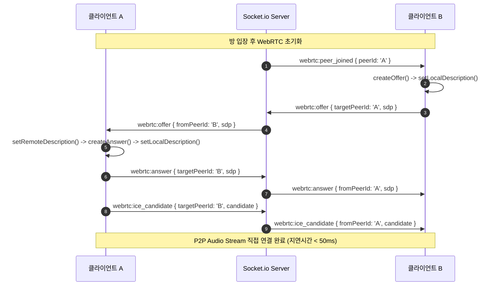

# [기술 설계 명세서] 러브레터 온라인 (Love Letter Online) 시스템 아키텍처 및 상세 설계 명세서

**문서 버전**: v1.0.0  
**작성자**: bkit-cto-lead (Technical Architect / CTO)  
**기반 문서**: [PRD] 러브레터 온라인 제품 요구사항 명세서 및 기능 마스터 플랜 (`love_letter_prd_and_master_plan.md`)  
**상태**: Approved (구현 준비 완료)

---

## 1. 시스템 아키텍처 개요 (System Architecture Overview)

### 1.1 아키텍처 설계 원칙 & 핵심 제약 조건
1. **단일 임베딩 컴포넌트 지향 (Single JSX Embeddable Component)**:
   - 외부 웹 서비스나 상위 React 애플리케이션 어디에든 `<LoveLetterApp />` 단일 컴포넌트 형태로 즉시 임베딩될 수 있도록 설계합니다.
   - 스타일은 외부 CSS 번들 충돌을 원천 차단하기 위해 **styled-components**를 기반으로 컴포넌트 내부에 100% 캡슐화합니다.
2. **단일 Node.js/Express + Socket.io 백엔드 (Monolithic Single Server)**:
   - Google OAuth2 인증 엔드포인트(`/api/auth/google`)와 실시간 게임 룸/시그널링 Socket.io 서버를 단일 Node.js 프로세스에서 구동합니다.
   - 모든 REST API 요청은 반드시 `/api/...` 프리픽스를 사용합니다.
3. **서버 권한 게임 상태 (Server-Authoritative Game State)**:
   - 모든 덱 셔플, 카드 드로우, 카드 효과 검증, 탈락 판정은 백엔드 메모리에서 단독 수행하며, 클라이언트 조작(Cheat)을 원천 차단합니다.
   - 상대방의 손패 정보는 사제(Priest) 투시 등 허용된 룰을 제외하고는 절대 다른 클라이언트로 전송하지 않습니다.
4. **P2P Mesh WebRTC & 비용 제로 실시간 미디어**:
   - 2~6인 소규모 음성 통화이므로 고비용 SFU/MCU 미디어 서버 없이 브라우저 간 P2P Mesh(WebRTC Data/Audio Stream) 및 Socket.io 시그널링으로 구현합니다.
5. **무료 브라우저 내장 음성 AI (Web Speech API)**:
   - 유료 외부 STT API 대신 브라우저 표준 Web Speech API를 활용하여 한국어 음성을 실시간 텍스트로 변환하고 화면 내 말풍선 및 채팅 로그와 동기화합니다.

---

### 1.2 전체 시스템 컨텍스트 다이어그램 (C4 System Context)

```mermaid
graph TB
    subgraph BrowserClient ["클라이언트 브라우저 (React SPA / Embeddable App)"]
        UI["단일 React UI Root (<LoveLetterApp />)"]
        StyledTheme["styled-components 테마 & 스타일 시스템"]
        HookAuth["useAuth (Google GIS Auth)"]
        HookSocket["useSocket (Socket.io Client)"]
        HookGame["useGameState (Game View State)"]
        HookWebRTC["useWebRTC (P2P Audio Mesh & VAD)"]
        HookSTT["useSTT (Web Speech API ko-KR)"]
    end

    subgraph BackendServer ["단일 백엔드 서버 (Node.js + Express + Socket.io)"]
        ExpressApp["Express App Router (/api/*)"]
        AuthService["Google OAuth Token Verifier"]
        SocketServer["Socket.io Server Engine"]
        RoomMgr["Room & Lobby Manager (In-Memory)"]
        GameEngine["Love Letter Rule Engine (1~8 Cards)"]
        AIBotMgr["AI Bot Strategy Controller"]
    end

    subgraph ExternalServices ["외부 서비스"]
        GoogleOAuth["Google Identity Services (GIS)"]
        STUN["Public STUN Server (Google STUN)"]
    end

    UI --> StyledTheme
    UI --> HookAuth
    UI --> HookSocket
    UI --> HookGame
    UI --> HookWebRTC
    UI --> HookSTT

    HookAuth <==> |HTTPS POST /api/auth/google| ExpressApp
    ExpressApp --> AuthService
    AuthService <==> |Verify Token| GoogleOAuth

    HookSocket <==> |WebSocket Events / Bi-directional| SocketServer
    SocketServer --> RoomMgr
    RoomMgr --> GameEngine
    GameEngine --> AIBotMgr

    HookWebRTC <==> |ICE / Candidate Discovery| STUN
    HookWebRTC <===> |Signaling Relay| SocketServer
    HookWebRTC <-.-> |P2P Audio Stream (Mesh)| HookWebRTC
```

---

## 2. 단일 임베딩 프론트엔드 컴포넌트 아키텍처

### 2.1 컴포넌트 계층 구조 & 파일 구성
기존 서비스에 번들링하여 단일 태그로 임베딩할 수 있도록 최상위 `<LoveLetterApp />` 컴포넌트 내부에서 상태 및 뷰 레이어를 합성(Composition)합니다.

```
src/
└── components/love-letter/
    ├── LoveLetterApp.jsx              # 단일 임베딩 메인 엔트리 컴포넌트
    ├── styles/
    │   ├── theme.js                   # 게임 컬러 팔레트, 폰트, 애니메이션 Keyframes
    │   └── GlobalAndSharedStyles.js   # styled-components 기반 전역/공통 스타일
    ├── hooks/
    │   ├── useAuth.js                 # 구글 로그인 및 세션 토큰 관리
    │   ├── useSocket.js               # Socket.io 라이프사이클 및 이벤트 리스너 바인딩
    │   ├── useGameState.js            # 러브레터 게임 클라이언트 상태 및 유효수(Valid Moves) 계산
    │   ├── useWebRTC.js               # P2P Mesh 오디오 스트림, 볼륨 제어, VAD 파동 감지
    │   └── useSTT.js                  # Web Speech API 한국어 전사 및 말풍선 트리거
    └── subcomponents/
        ├── AuthModal.jsx              # Google 원클릭 로그인 모달
        ├── LobbyView.jsx              # 방 생성, 룸 코드 입력, 대기실, AI 봇 슬롯 제어
        ├── GameTableView.jsx          # 원형/타원형 테이블 레이아웃 및 덱/버린 카드 무덤
        ├── PlayerSlot.jsx             # 플레이어 아바타, 하녀 방패, VAD 음성 링, 실시간 말풍선
        ├── HandCardsView.jsx          # 본인 손패(1~2장), 호버 효과 및 카드 액션 트리거
        ├── CardActionModal.jsx        # 경비병(타깃/숫자 선택), 사제(패 공개), 남작(비교) 모달
        ├── VoiceControlBar.jsx        # 마이크 토글, 스피커 음소거, 개별 볼륨 슬라이더
        └── ChatAndLogPanel.jsx        # 텍스트 채팅 & 음성 STT 전사 통합 로그 피드
```

### 2.2 styled-components 기반 디자인 시스템 & CSS 통합 명세
스타일 충돌을 방지하기 위해 CSS 클래스명 대신 styled-components의 Scoped CSS를 적용합니다.

```javascript
// src/components/love-letter/styles/theme.js
export const loveLetterTheme = {
  colors: {
    primary: '#8B0000',        // 클래식 버건디 와인 (러브레터 시그니처)
    primaryHover: '#A52A2A',
    secondary: '#D4AF37',      // 앤틱 골드 (테두리 및 강조)
    secondaryGlow: 'rgba(212, 175, 55, 0.4)',
    backgroundDark: '#120E16',  // 깊은 벨벳 다크 배경
    tableFelt: '#1E3A2B',      // 고급 카지노 그린 펠트
    cardBackground: '#FFFDF9',
    textMain: '#F5EBE6',
    textMuted: '#A09B97',
    shieldBlue: '#38BDF8',     // 하녀 방패 컬러
    vadGreen: '#22C55E',       // 음성 발화 파동 링 컬러
    dangerRed: '#EF4444',      // 탈락 및 에러 컬러
    panelBg: 'rgba(20, 16, 26, 0.85)',
  },
  shadows: {
    cardDefault: '0 8px 16px rgba(0, 0, 0, 0.3)',
    cardHover: '0 16px 32px rgba(212, 175, 55, 0.4), 0 0 12px rgba(212, 175, 55, 0.6)',
    modalGlow: '0 0 40px rgba(139, 0, 0, 0.5)',
  },
  transitions: {
    cardHover: 'all 0.25s cubic-bezier(0.4, 0, 0.2, 1)',
    bubbleFade: 'all 0.3s ease-in-out',
  }
};
```

---

## 3. 백엔드 REST API 인터페이스 명세 (Backend REST API)

모든 REST API 요청은 `/api/...` 프리픽스를 사용합니다.

### 3.1 Google OAuth2 로그인 토큰 검증 API
- **Endpoint**: `POST /api/auth/google`
- **Description**: 프론트엔드 Google Identity Services(GIS)로부터 수신한 ID Token(`credential`)을 백엔드에서 `google-auth-library`로 무결성 검증하고, 세션 유저 객체 및 서명된 JWT 액세스 토큰을 발급합니다.
- **Headers**:
  ```http
  Content-Type: application/json
  ```
- **Request Body**:
  ```json
  {
    "credential": "eyJhbGciOiJSUzI1NiIsImtpZCI6..." // Google OAuth2 ID Token (JWT)
  }
  ```
- **Success Response (`200 OK`)**:
  ```json
  {
    "success": true,
    "user": {
      "id": "usr_g10839219382103",
      "googleId": "108392193821039102931",
      "email": "player@example.com",
      "name": "홍길동",
      "picture": "https://lh3.googleusercontent.com/a/ACg8oc...",
      "customNickname": "홍길동"
    },
    "token": "eyJhbGciOiJIUzI1NiIsInR5cCI6IkpXVCJ9..." // 서버 세션 JWT (만료 24시간)
  }
  ```
- **Error Response (`401 Unauthorized` / `400 Bad Request`)**:
  ```json
  {
    "success": false,
    "error": {
      "code": "INVALID_GOOGLE_TOKEN",
      "message": "구글 인증 토큰이 유효하지 않거나 만료되었습니다."
    }
  }
  ```

---

### 3.2 서버 헬스체크 및 룸 상태 조회 API
- **Endpoint**: `GET /api/health`
- **Description**: 서버 프로세스 생존 여부 및 현재 활성화된 방/소켓 접속자 수 통계를 반환합니다.
- **Success Response (`200 OK`)**:
  ```json
  {
    "status": "healthy",
    "timestamp": "2026-08-30T01:20:00.000Z",
    "activeRoomsCount": 12,
    "connectedSocketsCount": 42
  }
  ```

- **Endpoint**: `GET /api/rooms/:roomCode/check`
- **Description**: 룸 코드 존재 여부 및 방 입장 가능 상태(게임 진행 중 여부, 정원 초과 여부)를 사전 검증합니다.
- **Success Response (`200 OK`)**:
  ```json
  {
    "exists": true,
    "roomCode": "LV87X2",
    "status": "WAITING", // WAITING | PLAYING | FINISHED
    "playerCount": 3,
    "maxPlayers": 4,
    "isFull": false
  }
  ```

---

## 4. 실시간 Socket.io 이벤트 및 메시지 프로토콜 명세

Socket.io를 통해 룸 관리, WebRTC 시그널링, 러브레터 게임 플레이, 실시간 STT 및 채팅을 양방향 통신합니다.

### 4.1 소켓 연결 및 인증 핸드셰이크
클라이언트는 Socket.io 연결 시 `auth` 객체에 JWT 토큰과 유저 정보를 전달합니다.
```javascript
const socket = io({
  path: '/socket.io',
  auth: {
    token: authToken,
    user: currentUser
  }
});
```

---

### 4.2 이벤트 프로토콜 총괄표 (C2S: 클라이언트->서버 / S2C: 서버->클라이언트)

| 대분류 | 이벤트명 | 방향 | 설명 |
| :--- | :--- | :---: | :--- |
| **Room/Lobby** | `room:create` | C2S | 새 방 생성 및 6자리 룸 코드 발급 요청 |
| | `room:join` | C2S | 특정 룸 코드로 방 입장 요청 |
| | `room:leave` | C2S | 방 퇴장 |
| | `room:ready` | C2S | 준비(Ready) 상태 토글 |
| | `room:add_bot` | C2S | [방장 전용] AI 봇 슬롯 추가 |
| | `room:remove_bot` | C2S | [방장 전용] 특정 AI 봇 퇴장 |
| | `room:update_settings` | C2S | [방장 전용] 목표 토큰 수(2~7) 및 최대 인원 설정 변경 |
| | `room:state_sync` | S2C | 룸 메타데이터 및 전체 플레이어 목록 브로드캐스트 |
| **Game Control** | `game:start` | C2S | [방장 전용] 게임 시작 요청 |
| | `game:round_started` | S2C | 라운드 시작, 초기 손패 1장 분배 및 선 턴 지정 |
| | `game:turn_started` | S2C | 특정 플레이어의 턴 시작 알림 & 드로우 카드 동기화 |
| | `game:play_card` | C2S | [현재 턴 플레이어] 카드 1장 제출 및 효과 타깃 지정 |
| | `game:card_played_broadcast`| S2C | 누가 어떤 카드를 냈는지 필드 공개 브로드캐스트 |
| | `game:secret_reveal` | S2C | [사제/남작 전용 개인 채널] 대상의 손패 정보 비공개 전송 |
| | `game:player_eliminated` | S2C | 플레이어 탈락 알림 (사유, 탈락자 ID, 공개된 손패) |
| | `game:round_ended` | S2C | 라운드 승자 발표, 토큰 획득 내역 및 전원 손패 오픈 |
| | `game:match_game_over` | S2C | 목표 토큰 달성 최종 우승자 발표 및 매치 종료 |
| **WebRTC Voice** | `webrtc:offer` | C2S/S2C | WebRTC SDP Offer 시그널링 릴레이 |
| | `webrtc:answer` | C2S/S2C | WebRTC SDP Answer 시그널링 릴레이 |
| | `webrtc:ice_candidate` | C2S/S2C | ICE Candidate 교환 릴레이 |
| | `webrtc:peer_joined` | S2C | 새 음성 피어 참가 알림 -> Offer 생성 트리거 |
| | `webrtc:peer_left` | S2C | 음성 피어 이탈 알림 -> PeerConnection 정리 |
| **STT & Chat** | `chat:send` | C2S | 일반 텍스트 채팅 또는 음성 STT 확정 텍스트 전송 |
| | `chat:broadcast` | S2C | 전체 룸 텍스트 채팅 메시지 수신 |
| | `stt:interim` | C2S/S2C | 실시간 발화 중간 전사 텍스트 (아바타 말풍선 즉시 렌더링) |

---

### 4.3 핵심 소켓 이벤트 Payload JSON 스키마

#### 1) `room:state_sync` (S2C)
```json
{
  "roomCode": "LV87X2",
  "hostId": "usr_g10839219382103",
  "status": "WAITING", // "WAITING" | "PLAYING" | "ROUND_END" | "GAME_OVER"
  "settings": {
    "maxPlayers": 4,
    "targetTokens": 4,
    "deckExtension": false
  },
  "players": [
    {
      "id": "usr_g10839219382103",
      "socketId": "sock_abc123",
      "name": "홍길동",
      "picture": "https://lh3.googleusercontent.com/...",
      "isHost": true,
      "isBot": false,
      "isReady": true,
      "tokens": 1,
      "isAlive": true,
      "isProtected": false, // 하녀 방패 활성화 여부
      "handCount": 1,
      "discards": [ { "cardId": "c_g1", "cardNumber": 1, "name": "경비병" } ]
    },
    {
      "id": "bot_smart_1",
      "socketId": null,
      "name": "AI 알파봇",
      "picture": "/assets/bot_avatar.png",
      "isHost": false,
      "isBot": true,
      "botDifficulty": "SMART",
      "isReady": true,
      "tokens": 0,
      "isAlive": true,
      "isProtected": true,
      "handCount": 1,
      "discards": [ { "cardId": "c_h1", "cardNumber": 4, "name": "하녀" } ]
    }
  ]
}
```

#### 2) `game:turn_started` (S2C)
```json
{
  "currentTurnPlayerId": "usr_g10839219382103",
  "turnCount": 5,
  "deckRemaining": 10,
  "drawnCard": { // 본인 턴일 경우에만 카드 정보 포함, 타인에게는 null
    "cardId": "c_p1",
    "cardNumber": 5,
    "name": "왕자",
    "effect": "자신/타인 1명 지목 손패 버리고 드로우"
  },
  "timeLimitSeconds": 30
}
```

#### 3) `game:play_card` (C2S)
```json
{
  "cardId": "c_g1",                 // 내려놓을 카드 고유 ID
  "cardNumber": 1,                  // 카드 번호 (1~8)
  "targetPlayerId": "bot_smart_1",  // 효과 대상 플레이어 ID (자신/타인/null)
  "guessedCardNumber": 5            // 경비병(1)일 경우 추측한 카드 번호 (2~8)
}
```

#### 4) `game:secret_reveal` (S2C - 개인 송신)
```json
{
  "type": "PRIEST_PEEK", // "PRIEST_PEEK" | "BARON_COMPARE"
  "targetPlayerId": "bot_smart_1",
  "targetPlayerName": "AI 알파봇",
  "revealedCard": {
    "cardNumber": 8,
    "name": "공주"
  },
  "message": "AI 알파봇 님의 손패는 [8번 공주] 입니다!"
}
```

#### 5) `stt:interim` & `chat:send` (C2S/S2C)
```json
// stt:interim (실시간 말풍선용)
{
  "speakerId": "usr_g10839219382103",
  "speakerName": "홍길동",
  "text": "나 하녀 썼으니까",
  "isFinal": false
}

// chat:send (최종 확정 채팅 및 피드)
{
  "senderId": "usr_g10839219382103",
  "senderName": "홍길동",
  "text": "나 하녀 썼으니까 공격하지 마!",
  "isVoiceSTT": true,
  "timestamp": 1724976000000
}
```

---

## 5. 러브레터 서버 권한 룰 엔진 & 상태 머신 (Love Letter Rule Engine)

### 5.1 카드 데이터 모델 및 효과 명세 (1~8번)

```javascript
export const LOVE_LETTER_CARDS = {
  1: { number: 1, name: '경비병', nameEn: 'Guard', count: 5, targetReq: 'OTHER_NOT_PROTECTED', guessReq: true },
  2: { number: 2, name: '사제', nameEn: 'Priest', count: 2, targetReq: 'OTHER_NOT_PROTECTED', guessReq: false },
  3: { number: 3, name: '남작', nameEn: 'Baron', count: 2, targetReq: 'OTHER_NOT_PROTECTED', guessReq: false },
  4: { number: 4, name: '하녀', nameEn: 'Handmaid', count: 2, targetReq: 'NONE', guessReq: false },
  5: { number: 5, name: '왕자', nameEn: 'Prince', count: 2, targetReq: 'ANY_NOT_PROTECTED_INCLUDE_SELF', guessReq: false },
  6: { number: 6, name: '국왕', nameEn: 'King', count: 1, targetReq: 'OTHER_NOT_PROTECTED', guessReq: false },
  7: { number: 7, name: '백작부인', nameEn: 'Countess', count: 1, targetReq: 'NONE', guessReq: false },
  8: { number: 8, name: '공주', nameEn: 'Princess', count: 1, targetReq: 'NONE', guessReq: false },
};
```

---

### 5.2 룰 엔진 핵심 카드 로직 트랜잭션 흐름도

```mermaid
flowchart TD
    Start([플레이어가 카드 제출 요청]) --> CheckTurn{현재 본인 턴인가?}
    CheckTurn -- 아니오 --> Reject[에러: 현재 턴이 아닙니다]
    CheckTurn -- 예 --> CheckPossession{플레이어 손에 실제 있는 카드인가?}
    CheckPossession -- 아니오 --> Reject2[에러: 보유하지 않은 카드입니다]
    CheckPossession -- 예 --> CheckCountessRule{패에 7번 백작부인이 있고\n5번 왕자 or 6번 국왕을 내려는가?}
    CheckCountessRule -- 예 --> Reject3[에러: 백작부인을 먼저 제출해야 합니다]
    CheckCountessRule -- 아니오 --> CheckTarget{타깃 및 하녀 방패 유효성 검사}

    CheckTarget --> ProcessCard[카드 번호별 효과 집행]
    
    ProcessCard --> C1[1번 경비병: 상대 패 == 추측 번호 ? 상대 즉시 탈락 : 불발]
    ProcessCard --> C2[2번 사제: 대상 손패를 시전자에게만 secret_reveal]
    ProcessCard --> C3[3번 남작: 시전자 vs 대상 숫자 비교 -> 낮은 쪽 즉시 탈락 (동점 무효)]
    ProcessCard --> C4[4번 하녀: 시전자 isProtected = true 설정]
    ProcessCard --> C5[5번 왕자: 대상 패 버림 -> 8번 공주면 탈락, 아니면 새 카드 드로우]
    ProcessCard --> C6[6번 국왕: 시전자 손패 <-> 대상 손패 swap]
    ProcessCard --> C7[7번 백작부인: 특수 효과 없음, 정상 디스카드]
    ProcessCard --> C8[8번 공주: 제출 즉시 시전자 탈락 처리]

    C1 & C2 & C3 & C4 & C5 & C6 & C7 & C8 --> CheckRoundEnd{생존자 1명이거나\n덱이 소진되었는가?}
    CheckRoundEnd -- 예 --> EndRound[라운드 승자 결정 & 토큰 지급]
    CheckRoundEnd -- 아니오 --> NextTurn[다음 생존 플레이어에게 턴 인계]
```

---

### 5.3 엣지 케이스 처리 알고리즘 완벽 정의

| 엣지 케이스 상황 | 엔진 처리 알고리즘 |
| :--- | :--- |
| **1. 모든 상대가 하녀(4) 보호 상태일 때** | - 1(경비병), 2(사제), 3(남작), 6(국왕)을 내야 하는 경우, 유효한 타깃이 없으므로 `targetPlayerId: null`로 카드를 그냥 버릴 수 있도록 허용하고 효과는 No-op 처리.<br>- 단, **5번(왕자)**은 "자신을 포함"하므로 타깃 선택지에서 상대방이 비활성화되고 **반드시 자기 자신(`targetPlayerId = self.id`)을 선택**하여 본인 패를 버리고 새로 드로우해야 함. |
| **2. 왕자(5) 발동 시 덱 잔여 카드가 0장일 때** | - 라운드 시작 시 게임에서 비공개로 제외해 두었던 **`secretSetAsideCard(비밀 카드)`** 1장을 버려진 플레이어의 손패로 드로우 지급. |
| **3. 왕자(5)로 인해 공주(8)가 버려졌을 때** | - 공주 카드의 고유 패시브(`onDiscard: eliminate`)가 발동하여 해당 플레이어는 즉시 탈락 처리되며, 새 카드를 드로우하지 않음. |
| **4. 덱 소진 시 동점자(Tie-breaker) 처리** | - 생존 플레이어들의 손패 숫자가 같을 경우, 각 플레이어가 해당 라운드에서 **지금까지 필드에 버린 카드들의 숫자 총합(Sum of Discards)**을 비교하여 더 높은 플레이어가 승리. 이 또한 같으면 공동 승리(각각 토큰 1개). |
| **5. 턴 제한 시간(30초) 초과 시** | - 타이머 만료 시 서버 엔진이 무작위 합법 카드 1장을 자동 제출(백작부인 룰 준수)하거나 플레이어를 타임아웃 패배 처리. |

---

## 6. WebRTC P2P 음성 엔진 & VAD 설계 (Voice & VAD Architecture)

### 6.1 Full Mesh WebRTC 시그널링 흐름



### 6.2 Web Audio API VAD (Voice Activity Detection) 오디오 파이프라인

```javascript
// src/components/love-letter/hooks/useWebRTC.js 내부 VAD 모듈
export function setupVAD(stream, onSpeakingChange) {
  const audioContext = new (window.AudioContext || window.webkitAudioContext)();
  const source = audioContext.createMediaStreamSource(stream);
  const analyser = audioContext.createAnalyser();
  analyser.fftSize = 512;
  analyser.smoothingTimeConstant = 0.4;
  source.connect(analyser);

  const dataArray = new Uint8Array(analyser.frequencyBinCount);
  let isSpeaking = false;
  let silenceTimer = null;

  const checkVolume = () => {
    analyser.getByteFrequencyData(dataArray);
    const sum = dataArray.reduce((acc, val) => acc + val, 0);
    const average = sum / dataArray.length; // 0 ~ 255
    const SPEAKING_THRESHOLD = 28; // 볼륨 임계치 (-45dB 상당)

    if (average > SPEAKING_THRESHOLD) {
      if (!isSpeaking) {
        isSpeaking = true;
        onSpeakingChange(true);
      }
      if (silenceTimer) clearTimeout(silenceTimer);
      silenceTimer = setTimeout(() => {
        isSpeaking = false;
        onSpeakingChange(false);
      }, 400); // 400ms 디바운스로 말 끊김 방지
    }
    requestAnimationFrame(checkVolume);
  };
  checkVolume();

  return () => {
    if (silenceTimer) clearTimeout(silenceTimer);
    audioContext.close();
  };
}
```

---

## 7. Web Speech API 한국어 실시간 STT 엔진 설계 (Korean STT Engine)

### 7.1 STT 엔진 라이프사이클 및 말풍선 트리거 구조

```javascript
// src/components/love-letter/hooks/useSTT.js
export function useSTT({ isMicMuted, onInterimSpeech, onFinalSpeech }) {
  const recognitionRef = useRef(null);

  useEffect(() => {
    const SpeechRecognition = window.SpeechRecognition || window.webkitSpeechRecognition;
    if (!SpeechRecognition) {
      console.warn('Web Speech API is not supported in this browser.');
      return;
    }

    const recognition = new SpeechRecognition();
    recognition.lang = 'ko-KR';
    recognition.continuous = true;
    recognition.interimResults = true;
    recognition.maxAlternatives = 1;

    recognition.onresult = (event) => {
      let interimTranscript = '';
      for (let i = event.resultIndex; i < event.results.length; ++i) {
        const transcript = event.results[i][0].transcript;
        if (event.results[i].isFinal) {
          if (transcript.trim().length > 0) {
            onFinalSpeech(transcript.trim());
          }
        } else {
          interimTranscript += transcript;
        }
      }
      if (interimTranscript.trim().length > 0) {
        onInterimSpeech(interimTranscript.trim());
      }
    };

    recognition.onerror = (err) => {
      // no-speech, audio-capture 에러 등 발생 시 안전 복구
      if (err.error !== 'no-speech') {
        console.warn('STT Error:', err.error);
      }
    };

    recognition.onend = () => {
      // 마이크가 켜져 있으면 자동 재시작으로 상시 청취 유지
      if (!isMicMuted && recognitionRef.current) {
        try { recognition.start(); } catch (e) {}
      }
    };

    if (!isMicMuted) {
      try { recognition.start(); } catch (e) {}
    }

    recognitionRef.current = recognition;
    return () => {
      recognition.stop();
      recognitionRef.current = null;
    };
  }, [isMicMuted]);
}
```

---

## 8. AI 봇 컨트롤러 알고리즘 명세 (AI Bot Controller)

### 8.1 봇 의사결정 트리 및 휴리스틱 (Heuristic Decision Engine)

AI 봇은 서버 사이드에서 비동기 이벤트 큐로 실행되며, 자연스러운 사람 느낌을 위해 **1.2초 ~ 2.2초의 의사결정 지연(Human-like Think Delay)** 후 수를 둡니다.

```mermaid
flowchart TD
    BotTurn([AI 봇 턴 시작 & 2장 패 보유]) --> CountessCheck{패에 7번 백작부인이 있고\n5번 또는 6번이 있는가?}
    CountessCheck -- 예 --> PlayCountess[7번 백작부인 강제 제출]
    CountessCheck -- 아니오 --> MemoryCheck{사제로 확인하여 기억하고 있는\n상대방의 패가 있는가?}

    MemoryCheck -- 예 & 1번 경비병 보유 --> SnipeTarget[기억한 상대 지목 & 정확한 번호로 저격]
    MemoryCheck -- 아니오 or 경비병 없음 --> HandAnalysis{보유한 2장의 카드 조합 분석}

    HandAnalysis --> HasPrincess{8번 공주 보유?}
    HasPrincess -- 예 --> PlayOtherCard[공주가 아닌 다른 카드 무조건 제출]
    HasPrincess -- 아니오 --> HasHandmaid{4번 하녀 보유?}
    HasHandmaid -- 예 --> PlayHandmaid[생존율 극대화를 위해 4번 하녀 제출]
    HasHandmaid -- 아니오 --> HasBaron{3번 남작 보유 & 다른 카드가 5 이상인가?}
    HasBaron -- 예 --> PlayBaron[3번 남작 제출 -> 승산 높은 상대 지목 결투]
    HasBaron -- 아니오 --> ProbGuard[1번 경비병 제출 -> 필드 미공개 카드 중 최빈값(2,3,5) 추측]
```

### 8.2 경비병 확률 추측 계산 공식
AI 봇은 전체 덱 구성(총 16장)에서 **[자신의 손패 + 필드에 버려진 모든 카드 + 과거 사제로 본 카드]**를 차감하여 남아있는 카드의 잔여 수량 확률을 계산합니다.
$$\text{BestGuess} = \arg\max_{c \in \{2,3,4,5,6,7,8\}} \left( \text{RemainingCount}(c) \right)$$
만약 잔여 수가 동일할 경우, 위험도가 높은 **5번(왕자) -> 3번(남작) -> 2번(사제)** 순으로 우선순위를 부여합니다.

---

## 9. 통합 데이터 모델 및 상태 스키마 (Data Models)

```typescript
// 공통 데이터 타입 정의
export type CardNumber = 1 | 2 | 3 | 4 | 5 | 6 | 7 | 8;

export interface Card {
  cardId: string;
  cardNumber: CardNumber;
  name: string;
  nameEn: string;
}

export interface Player {
  id: string;
  socketId: string | null;
  name: string;
  picture: string;
  isHost: boolean;
  isBot: boolean;
  botDifficulty?: 'NORMAL' | 'SMART';
  isReady: boolean;
  tokens: number;
  isAlive: boolean;
  isProtected: boolean;
  hand: Card[];        // 서버 측에서만 전체 보관, 클라이언트에게는 본인 것만 전달
  discards: Card[];    // 해당 플레이어가 버린 카드 목록 (전체 공개)
}

export interface RoomState {
  roomCode: string;
  hostId: string;
  status: 'WAITING' | 'PLAYING' | 'ROUND_END' | 'GAME_OVER';
  settings: {
    maxPlayers: number;
    targetTokens: number;
    deckExtension: boolean;
  };
  players: Player[];
  deck: Card[];
  secretSetAsideCard: Card | null;
  faceUpRemovedCards: Card[]; // 2인 플레이 시 공개 제외 카드 3장
  currentTurnPlayerId: string | null;
  turnCount: number;
  winnerPlayerId: string | null;
}
```

---

## 10. 기술 검증(PoC) 및 테스트 계획 (Technical Verification Plan)

### 10.1 테스트 매트릭스 및 검증 시나리오

| 구분 | 테스트 항목 | 검증 절차 및 기대 결과 | 합격 기준 |
| :--- | :--- | :--- | :--- |
| **단위 테스트** | **Google OAuth 검증** | 유효한 Google ID 토큰과 위조/만료된 토큰을 `/api/auth/google`로 전송 | 위조 토큰에 대해 401 반환 및 유효 토큰에 대해 정확한 유저 프로필 JWT 반환 |
| **단위 테스트** | **1~8번 카드 엔진** | Jest 기반 가상 룸 상태를 생성하고 각 카드 제출 시 트랜잭션 검증 | 백작부인 제약, 공주 탈락, 왕자 덱 소진 시 비밀 카드 지급 등 엣지케이스 100% Pass |
| **통합 테스트** | **Socket.io 룸 라이프사이클** | 4개 클라이언트 소켓 연결 -> 룸 생성 -> 입장 -> Ready -> 시작 -> 턴 진행 | 모든 클라이언트 상태 동기화 오차 0건, 턴 전환 지연시간 < 50ms |
| **E2E / 미디어** | **WebRTC P2P Audio Mesh** | 4인 브라우저 접속 후 마이크 스트림 생성 및 상호 음성 송수신 확인 | 오디오 루프백 정상 통화, Mute/Deafen 및 VAD 파동 링 정상 발광 |
| **E2E / AI** | **한국어 STT & AI 봇 플레이** | 한국어 발화 시 아바타 말풍선 노출 및 AI 봇 3명과의 1인 4인 모드 풀 라운드 진행 | STT 전사 텍스트 90% 이상 정확도 노출 및 봇의 룰 준수 게임 완주 |

### 10.2 CI/CD 및 품질 보증 (QA) 파이프라인
1. **Lint & Type Check**: ESLint + Prettier + TypeScript 컴파일 체크
2. **Server Engine Rule Test**: `npm run test:engine` (모든 러브레터 룰 엣지케이스 25종 자동화 테스트)
3. **Socket Mock Test**: `supertest` 및 `socket.io-client`를 활용한 다자간 가상 게임 시뮬레이션

---

## 11. 결론 및 개발 가이드라인

본 설계 명세서는 PRD 요구사항을 100% 만족하며, 단일 컴포넌트 임베딩과 단일 Express/Socket 서버 구조를 위한 최적의 엔지니어링 청사진을 제공합니다.
개발팀은 명세서에 정의된 REST API 엔드포인트, Socket.io 이벤트 프로토콜 및 데이터 스키마를 준수하여 구현을 진행합니다.
